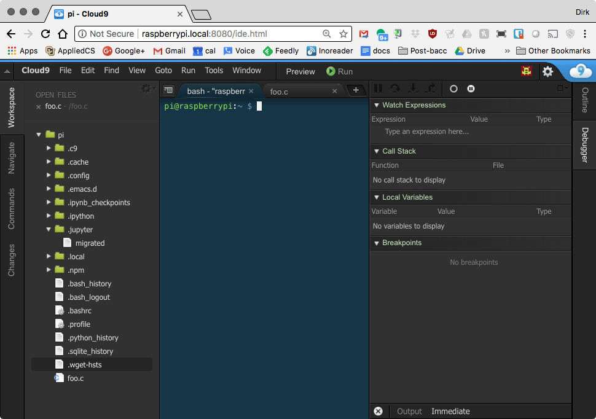
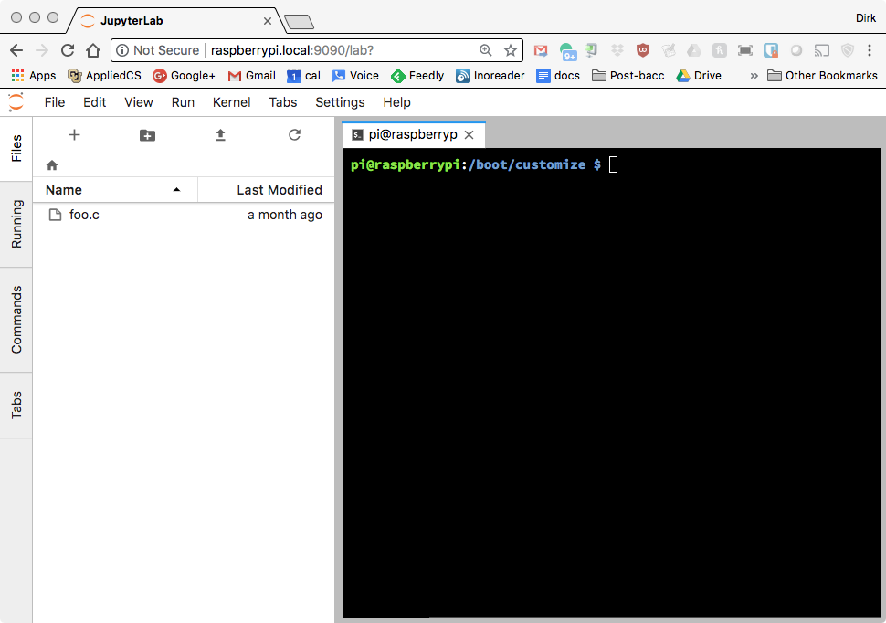

# raspberry-pi-c9-jupyterlab

# Purpose
This repository contains instructions and code to configure a raspberry pi to use [Cloud9](https://aws.amazon.com/cloud9/?origin=c9io) and/or [JupyterLab](https://blog.jupyter.org/jupyterlab-is-ready-for-users-5a6f039b8906) via WiFi, ethernet / usb. The end result is similar to the Cloud9 support [for the BeagleBone](http://beagleboard.org/support/bone101).

The features of the resulting image are:
* Provides a Cloud9 and JupyterLab browser based IDE with
  * Langauge aware text editor
  * File transfer using web drag & drop
  * Terminal interface via web browser
* Configures the Raspberry Pi to use multi-cast DNS so that you can locate the device as "raspberrypi.local"
* Works on Pi-Zero-W, Pi-2 and Pi-3B
* Lets you configure wireless access (Pi-Zero-W, Pi-3B) from the /boot partition
* Networking support:
  * Pi-Zero-W - usb OTG ethernet and/or WiFi
  * Pi-2 - Ethernet
  * Pi-3b - WiFi and Ethernet

The Jupyter Lab IDE is lighter weight than the Cloud9 IDE -- on a Pi-Zero-W, the C9 IDE takes about 4-5X the RAM.

# Configuration

There are three steps to configuring the image:
* Configure boot image to use multicast DNS and OTG ethernet
* Install Cloud9
* Install JupyterLab
* Install systemd daemons and wireless configuration scripts
* Customize the configuration

Once you have this done, you'll have an iamge that can be cloned.

## Configure boot image to use multicast DNS and OTG ethernet

There are several extensive sites with directions on how to do this. Basically [follow the directions as this site](http://www.circuitbasics.com/raspberry-pi-zero-ethernet-gadget/).

Once you've compeleted this step, you can either connect your Pi to Wifi or for a Pi-Zero-W, using an OTG USB device. You should be able to `ping raspberrypi.local` and once you can do that, you should be able to `ssh pi@raspverrypi.local` and login using password `raspberry`.

## Install Cloud9

You can [follow these directions](https://medium.com/@chintanp/using-cloud9-3-0-ide-on-raspberry-pi-954cf2d6ab8e) and get a working system. From my experience, you don't need to do Step #2 (installing nodejs) -- the cloud9 install actually downloads a specific (older) nodejs image.

Thus, the short recipe would be:
```
sudo apt-get update && sudo apt-get upgrade
cd /opt
git clone git://github.com/c9/core.git c9sdk
cd /opt/c9sdk
scripts/install-sdk.sh
```
This process takes a while because it builds the nodejs install from source.

You can test the install using:
```
/opt/c9sdk/server.js -p 8080 -l 0.0.0.0 -a : -w /home/pi
```

and then navigate to `http://raspberrypi.local:8080` from a machine on the same network and/or the machine into which the USB OTG cord is plugged.

It should look something like this 


## Install JupyterLab

The JupyterLab install will be done using `pip` and will install to `/home/pi/.local/bin/jupyter`.

You can follow the directions at [the jupyterlab site](http://jupyterlab.readthedocs.io/en/stable/getting_started/installation.html) which more or less amounts to:
```
sudo apt-get install python3-pip
pip3 install jupyterlab
```

This should install the following packages:
```
jupyter (1.0.0)
jupyter-client (5.2.3)
jupyter-console (5.2.0)
jupyter-core (4.4.0)
jupyterlab (0.32.1)
jupyterlab-launcher (0.10.5)
```

The installation is pretty quick. You can then test the install using
```
/home/pi/.local/bin/jupyter lab --ip="raspberrypi.local" --port=9090 --NotebookApp.token=''
```

You can then test the setup using `http://rasberrypi.local:9090`

The resulting system should look like this: 

# Install systemd daemons and wireless configuration scripts

Copy the files in subdirection `customize` to the `/boot` partition of your Pi sd card.

Copy the `*.service` files:
```
cp /boot/customize/pi-*.service /etc/systemd/system
```
You should then [enable the systemd services](https://www.digitalocean.com/community/tutorials/how-to-use-systemctl-to-manage-systemd-services-and-units).

```
sudo systemctl enable pi-c9sdk.service
sudo systemctl enable pi-jupyterlab.service
sudo systemctl enable pi-customize.service
```

You can check their status using:
```
pi@raspberrypi:/etc $ systemctl list-units | grep -i pi-
  pi-c9sdk.serviceloaded active running   start Cloud9SDK as user pi
● pi-customize.serviceloaded failed failed    copy config files from /boot
  pi-jupyterlab.serviceloaded active running   start jupyterlab as user pi
  ```

  ### Customize things

  The `pi-customize` service copies files from `/boot/customize` into `/etc/network/network-interfaces.d` using the script `/boot/customize/customize-network.sh` -- the specific configuration depends on Raspberry Pi model.

  The copy occurs each time that the raspberry pi is booted, overriding the files in `/etc/network`.

  You can modify `/boot/customize/network-interfaces.d/wpa_supplicant.conf` to set the WiFi network SSID and and password if you're using WiFi. When you reboot the Pi, the `wpa_supplicant` file will be copied over and the network will be joined.